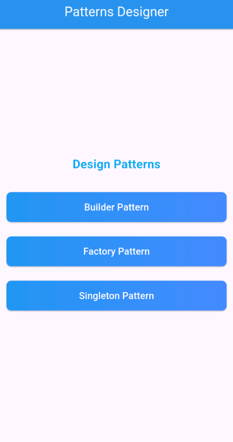
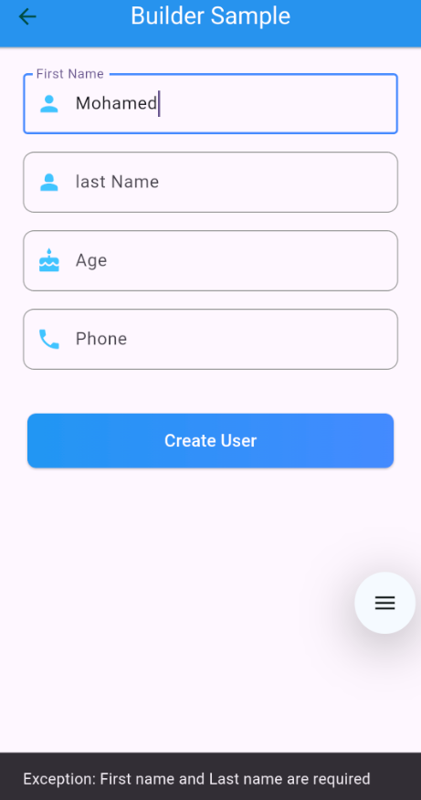
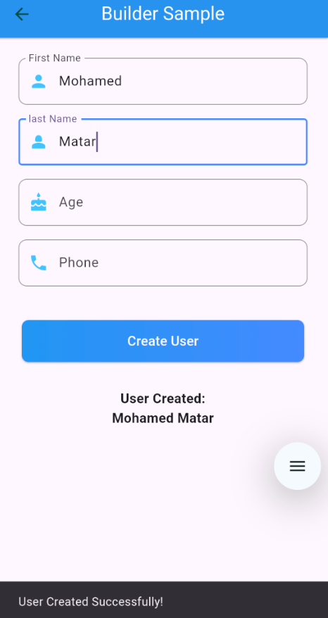
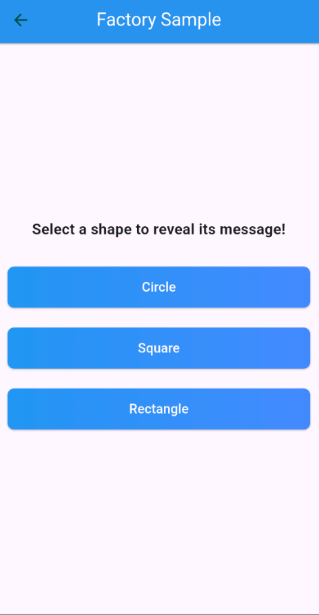
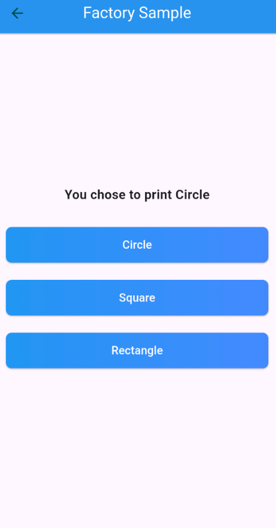
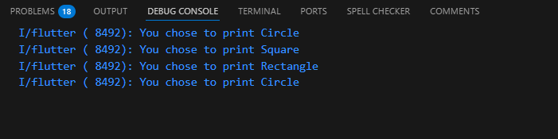
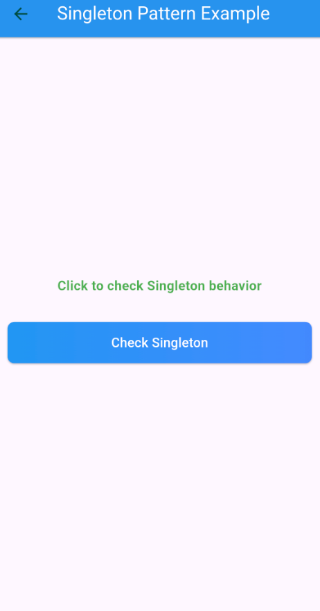
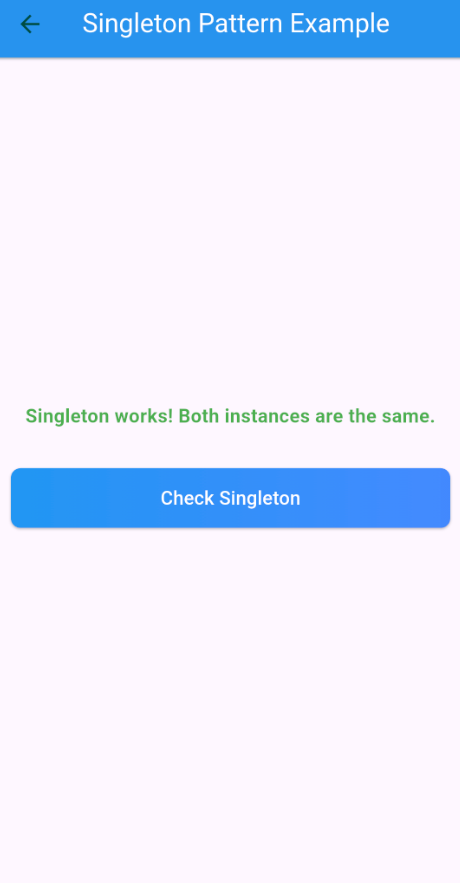
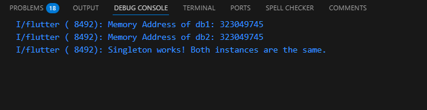

# Designer App
### This app is made to try out and explore some design patterns like Builder, Factory, and Singleton.

## Builder
We created a file that contains our `User` class and `UserBuilder` class, which will be used as a builder in our `User` class constructor.

```dart
class User {
  final String firstName;
  final String lastName;
  final int? age;
  final String? phone;

  User(UserBuilder builder)
      : firstName = builder.firstName!,
        lastName = builder.lastName!,
        age = builder.age,
        phone = builder.phone;
}

```
<br>

I modified the UserBuilder a little so i would be able to use it in a screen

```dart
class UserBuilder {
  String? firstName;
  String? lastName;
  int? age;
  String? phone;

  UserBuilder setFirstName(String firstName) {
    this.firstName = firstName;
    return this;
  }

  UserBuilder setLastName(String lastName) {
    this.lastName = lastName;
    return this;
  }

  UserBuilder setAge(int age) {
    this.age = age;
    return this;
  }

  UserBuilder setPhone(String phone) {
    this.phone = phone;
    return this;
  }

  User build() {
    if (firstName == null ||
        lastName == null ||
        firstName == "" ||
        lastName == "") {
      throw Exception("First name and Last name are required");
    }
    return User(this);
  }
}

```
<br>

<table border="1">
  <tr>
    <th>Homepage</th>

  </tr>
  <tr>
    <td></td>
  </tr>

  <tr>
    <th>Users Page</th>
    <th>Favorites Page</th>
  </tr>
  <tr>
    <td></td>
    <td></td>
  </tr>
</table>

<br>

---
---
---

## Factory Design Pattern
Created a file that defines an abstract `Shape` class with a `revealMe` method.  
Three concrete classes implements this method, (`Circle`, `Rectangle`, and `Square`),
each returning a message indicating the selected shape.

```dart
abstract class Shape {
  String revealMe();
}

class Circle implements Shape {
  @override
  String revealMe() {
    print("You chose to print Circle");
    return "You chose to print Circle";
  }
}

class Rectangle implements Shape {
  @override
  String revealMe() {
    print("You chose to print Rectangle");
    return "You chose to print Rectangle";
  }
}

class Square implements Shape {
  @override
  String revealMe() {
    print("You chose to print Square");
    return "You chose to print Square";
  }
}

```
<br>

The ShapeFactory class provides a centralized way to create shape objects
without exposing the instantiation logic to the client.

To instantiate objects based on a given shape type, we use the `ShapeFactory` class.  
It contains a static `getShape` method, which returns an instance of the requested shape.  
If an invalid shape type is provided, an exception is thrown.

```dart
class ShapeFactory {
  static Shape getShape(String shapeType) {
    switch (shapeType.toLowerCase()) {
      case "circle":
        return Circle();
      case "square":
        return Square();
      case "rectangle":
        return Rectangle();
      default:
        throw Exception("Invalid shape type");
    }
  }
}

```
<br>
<table border="1">
  <tr>
    <th>Homepage</th>
  </tr>
  <tr>
    <td></td>
  </tr>

  <tr>
    <th>Factory Page</th>
    <th>Factory selection Output</th>
  </tr>
  <tr>
    <td></td>
    <td></td>
  </tr>

  <tr>
    <th colspan="2">Console Output</th>
  </tr>
  <tr>
    <td colspan="2"></td>
  </tr>
</table>


<br>

---
---
---

## Singleton Design Pattern
The Singleton pattern ensures that only one instance of a class is created and provides a global access point to that instance.  
We define a `Database` class with a private constructor and a static method `getInstance()`  
to control the instantiation and ensure only one instance exists.

```dart
class Database {
  static Database? _instance;

  Database._internal();

  static Database getInstance() {
    if (_instance == null) {
      _instance = Database._internal();
    }
    return _instance!;
  }

  void connect() {
    print("Connected to the database");
  }
}

```
<br>

For Testing the Singleton, I created a Client class to test whether multiple calls to getInstance() return the same object.

By printing memory addresses and checking equality, we verify that the Singleton pattern is correctly implemented.

```dart
class Client {
  String testSingleton() {
    Database db1 = Database.getInstance();
    Database db2 = Database.getInstance();

    String message = "";

    // for extra clarity for myself I printed the address of both instances :)
    print("Memory Address of db1: ${identityHashCode(db1)}");
    print("Memory Address of db2: ${identityHashCode(db2)}");

    if (db1 == db2) {
      message = "Singleton works! Both instances are the same.";
      print("Singleton works! Both instances are the same.");
    } else {
      message = "Singleton failed! Instances are different.";
      print("Singleton failed! Instances are different.");
    }

    return message;
  }
}

```
<table border="1">
  <tr>
    <th>Homepage</th>
  </tr>
  <tr>
    <td></td>
  </tr>

  <tr>
    <th>Singleton Page</th>
    <th>Checking singleton</th>
  </tr>
  <tr>
    <td></td>
    <td></td>
  </tr>
  <tr>
    <th colspan="2">Console Output</th>
  </tr>
  <tr>
    <td colspan="2"></td>
  </tr>
</table>